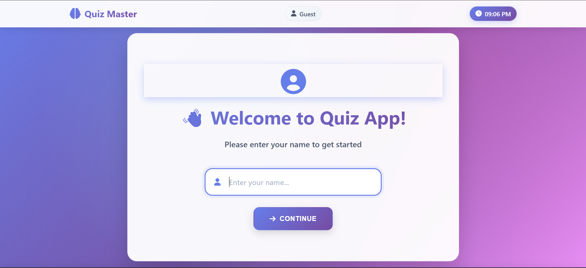
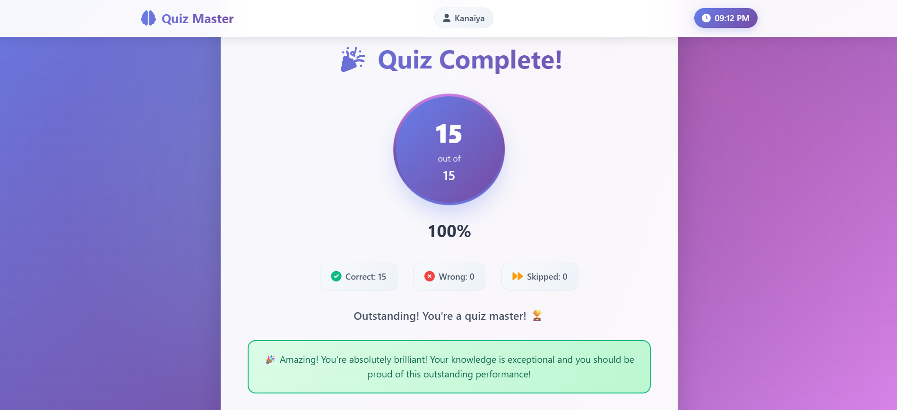
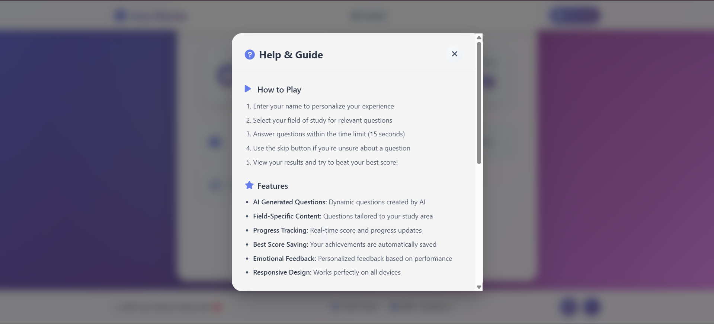
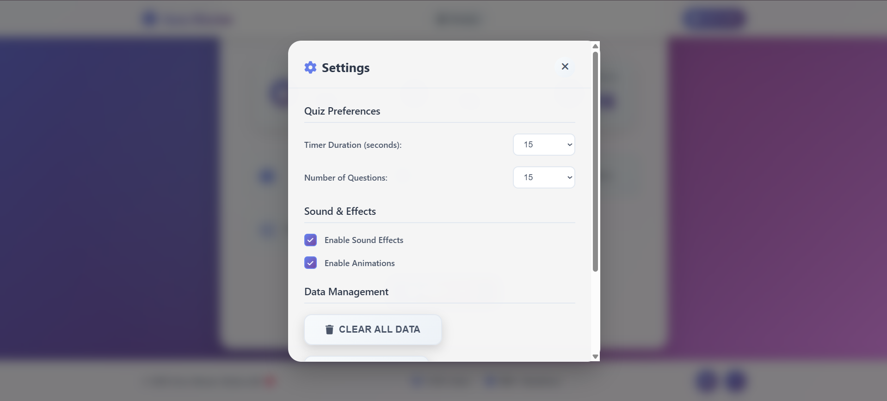

# Quiz Master

A modern, responsive quiz app built with HTML, CSS, and JavaScript.

## 🚀 Live Demo
[Click here to try the app!](https://kanaiya-rgb.github.io/quiz-app/)

## ✨ Features
- Field-specific questions (CSE, ECE, ME, CE, General)
- AI generated questions
- 15 second timer per question
- Skip question option
- Progress tracking and best score saving
- Responsive design (mobile friendly)
- Data export (CSV/JSON)
- Settings & Help modal

## 🛠️ Tech Stack
- HTML5
- CSS3 (Flexbox, Grid)
- JavaScript (ES6)
- [Font Awesome](https://fontawesome.com/)

## 🚀 Installation

1. Clone the repo:
   ```
   git clone https://github.com/Kanaiya-rgb/quiz-app.git
   ```
2. Open `index.html` in your browser.

## 📸 Screenshots

### Home Page


### Field Selection


### Quiz Page


### Quiz Question


### Quiz Complete


### Quiz Guide


### Quiz Setting


## 🤝 Contributing

Contributions, issues and feature requests are welcome!
Feel free to open an issue or submit a pull request.

## 📬 Contact

- [LinkedIn](https://www.linkedin.com/in/your-linkedin/)
- Email: kanaiyasoni688@gmail.com

## 📝 License

This project is licensed under the MIT License - see the [LICENSE](LICENSE) file for details.

---

Made with ❤️ by Kanaiya 