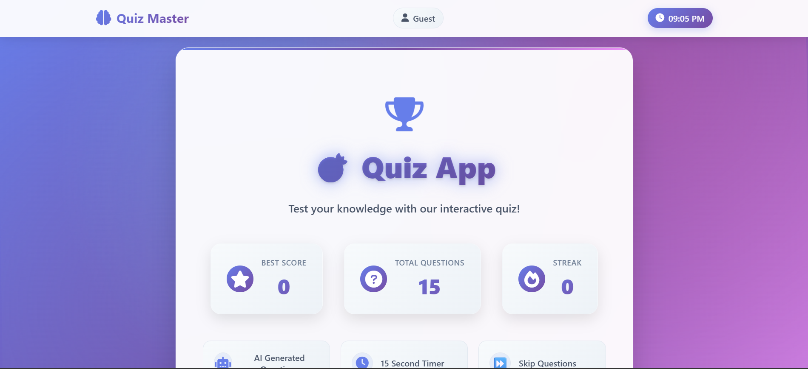

# Quiz Master

A modern, responsive quiz app built with HTML, CSS, and JavaScript.

## 🚀 Live Demo
[Click here to try the app!](https://kanaiya-rgb.github.io/quiz-app/)

## ✨ Features
- Field-specific questions (CSE, ECE, ME, CE, General)
- AI generated questions
- 15 second timer per question
- Skip question option
- Progress tracking and best score saving
- Responsive design (mobile friendly)
- Data export (CSV/JSON)
- Settings & Help modal

## 📸 Screenshots

### Home Page

### Field Selection

### Quiz Question

### Result Page

## 🛠️ How to Use
1. Enter your name
2. Select your field
3. Answer questions within the timer
4. Skip if unsure, see your results at the end!

## 📝 License
MIT

---

Made with ❤️ by Kanaiya 